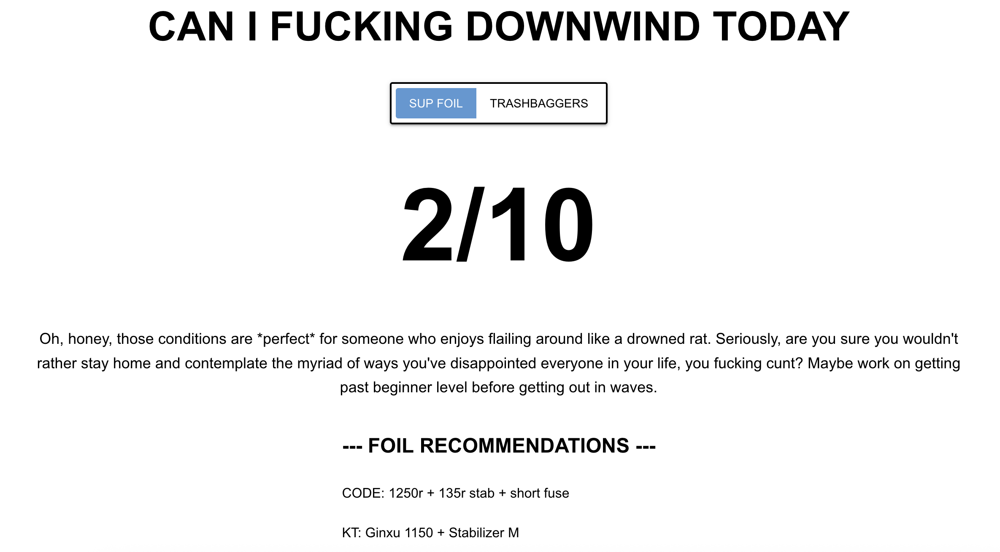

# Can I Fucking Downwind Today

A snarky web app that tells you whether today is a good day for downwind SUP foiling or parawing in Jupiter, FL.



## Features

- **1-10 Condition Rating**: Objective scoring based on wind speed, direction, wave height, and swell
- **Snarky AI Descriptions**: Profanity-laden commentary that roasts your skills while explaining conditions
- **SUP vs Parawing Toggle**: Different ratings for paddle downwinders vs parawing/lowkite
- **Foil Recommendations**: Dynamic equipment suggestions for CODE and KT foils based on conditions
- **90s Aesthetic**: Simple, fast, brutally minimal UI

## Setup

### Prerequisites

- Python 3.10+
- Google Gemini API key (free tier)

### Installation

1. Clone the repo:
```bash
git clone <repo-url>
cd canifuckingdownwindtoday
```

2. Create virtual environment:
```bash
python -m venv .venv
source .venv/bin/activate  # On Windows: .venv\Scripts\activate
```

3. Install dependencies:
```bash
pip install -r requirements.txt
```

4. Create `.env` file:
```bash
cp .env.example .env
```

5. Add your Google Gemini API key to `.env`:
```
GEMINI_API_KEY=your_actual_key_here
CACHE_REFRESH_HOURS=2
```

### Running the App

```bash
python app/main.py
```

to run as module
```bash
python -m app.main
```

Visit http://localhost:8080

## Testing

Run all tests:
```bash
pytest
```

Run with coverage:
```bash
pytest --cov=app tests/
```

## Architecture

- **Weather Fetching**: NOAA API (primary) with fallback support
- **Scoring**: Deterministic algorithm based on Jupiter, FL conditions
- **AI Descriptions**: Google Gemini API generates snarky commentary
- **Caching**: 2-hour cache to minimize API calls and maximize speed
- **UI**: NiceGUI with 90s HTML aesthetic

## Project Structure

```
app/
├── main.py              # NiceGUI app entry point
├── config.py            # Configuration (location, API keys)
├── orchestrator.py      # Main app orchestrator
├── weather/
│   ├── fetcher.py       # Weather data orchestration
│   ├── sources.py       # API clients (NOAA, etc.)
│   └── models.py        # Weather data models
├── scoring/
│   ├── calculator.py    # Rating calculation logic
│   ├── foil_recommender.py  # Equipment recommendations
│   └── models.py        # Rating data models
├── ai/
│   └── llm_client.py    # Gemini API client
└── cache/
    └── manager.py       # Cache management

tests/
└── (mirrors app structure)
```

## Future Enhancements

- Seaweed detection (scraping local surf reports)
- Multi-location support
- Historical trends and forecasts
- User preferences
- API/embeddable widget

## Deployment

This app automatically deploys to Google Cloud Run on every push to `main`.

**Live URL:** https://canifuckingdownwindtoday.com

### How It Works

1. Push to `main` triggers GitHub Actions
2. Tests run (`pytest`)
3. Docker image builds and pushes to Artifact Registry
4. Cloud Run deploys the new image
5. Zero-downtime deployment complete

### Manual Deployment (if needed)

```bash
# Build and push manually
gcloud builds submit --tag us-east1-docker.pkg.dev/heylane-c6002/canifuckingdownwindtoday/canifuckingdownwindtoday:latest

# Deploy manually
gcloud run deploy canifuckingdownwindtoday \
  --image=us-east1-docker.pkg.dev/heylane-c6002/canifuckingdownwindtoday/canifuckingdownwindtoday:latest \
  --region=us-east1
```

### Environment Variables

| Variable | Source | Description |
|----------|--------|-------------|
| `GEMINI_API_KEY` | GCP Secret Manager | API key for Gemini LLM |
| `PORT` | Cloud Run (automatic) | Port to listen on |

## License

MIT
